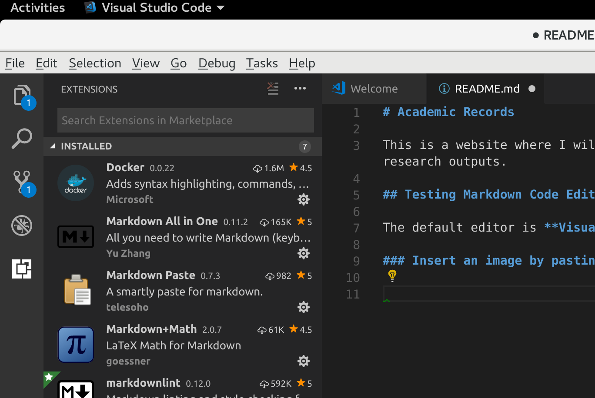

# Academic Records

This is a website where I will keep a record of my research outputs.

## Testing Markdown Code Editor

The default editor is **Visual Studio Code Editor**.

### Insert an image by pasting

